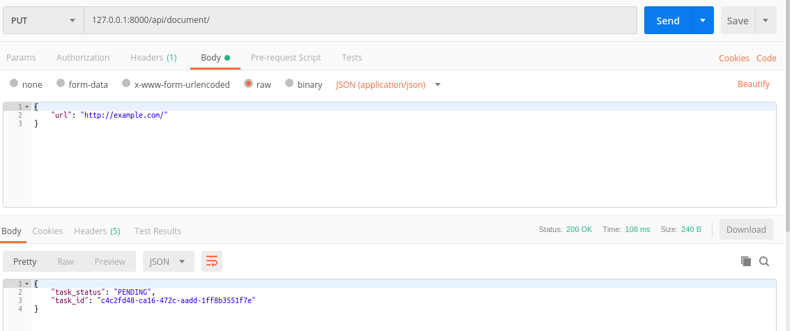
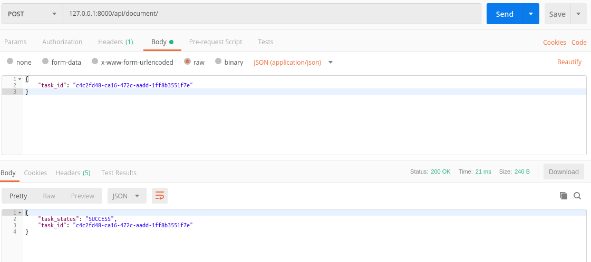
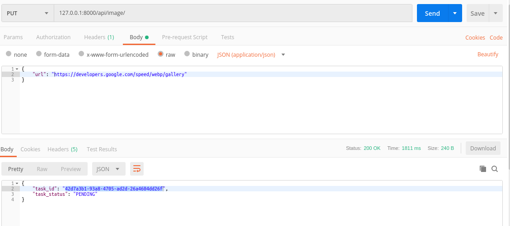
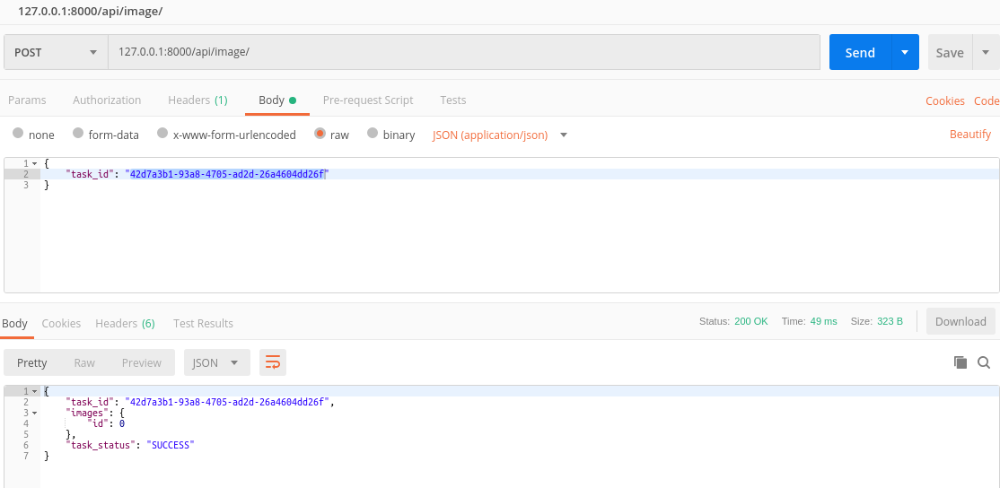
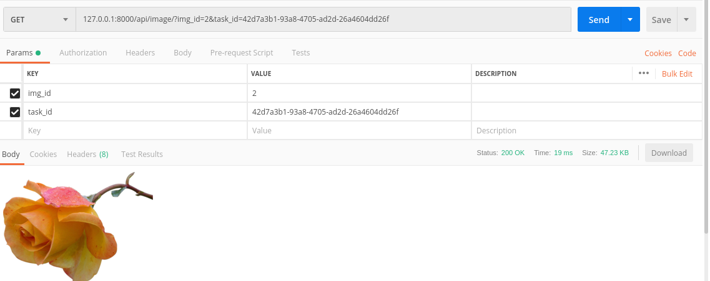

## REST API for fetching text and images from webpage.

### Setup

```
$ docker-compose up --build
```

After laucnch API will be available at http://localhost:8000/api/.

### Endpoints
#### `/api/documents/`
* PUT submit url to get text from the page.


* POST get task status.


* GET fetch result from submitted task.

#### `/api/image/`
* PUT submit url to get images from the page.


* POST get task status.


* GET fetch downloaded image.


